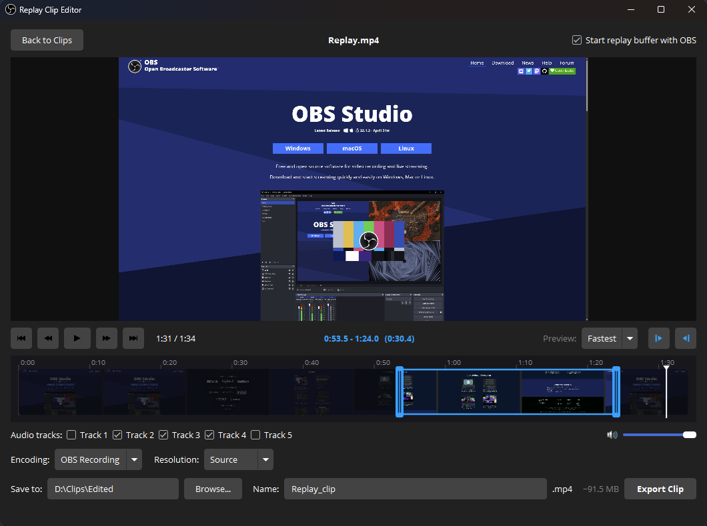

# Replay Clip Editor for OBS Studio

A replay trimmer inspired by Steam's Game Recording, now built into OBS Studio.
Grab what just happened, trim it down on a zoomable filmstrip timeline, pick which
audio tracks to keep, and export a clean clip without ever needing to leave OBS or
open a separate video editor.

> **Status:** v1.0.0 · **Windows only** (OBS Studio **31.x and 32.x**).
> macOS and Linux support is planned — see [Platform support](#platform-support).

## Features

- **One-key capture** — a single hotkey saves the replay buffer and drops the
  result straight into the editor, ready to trim.
- **Clip browser** — browse and reopen any recording in your OBS recording folder
  (or point it at a different folder).
- **Frame-accurate trimming** — a custom FFmpeg preview engine with frame-by-frame
  stepping, an in/out trim range, and a playhead you can scrub.
- **Zoomable filmstrip timeline** — wheel to zoom at the cursor, drag the zoom
  indicator to pan, drag the in/out handles to set your range.
- **Per-track audio** — enable or disable individual audio tracks in the export
  (game / mic / desktop, however you record).
- **Flexible export** — reuse your **OBS Recording** or **OBS Streaming** encoder
  settings for a one-click match, or go **Custom** (encoder, rate control,
  bitrate/CQ, container).
- **Smart downscaling** — export at source resolution or downscale to a standard
  resolution, never above the source (so clips are never upscaled).
- **Live size estimate** — see the approximate output file size before exporting,
  updated as you change encoder and resolution settings.

## Installation

### Windows (recommended)

1. Download the latest release from the
   [Releases page](https://github.com/ProbablyFineSoftware/obs-replay-clip-editor/releases).
2. **Make sure OBS Studio is closed completely.**
3. Use either package:
   - **Installer (`.exe`)** — run it and it places the files for you, **or**
   - **Portable (`.zip`)** — unzip it over your OBS Studio install folder
     (typically `C:\Program Files\obs-studio`), merging the `obs-plugins` and
     `data` folders.
4. Start OBS. You'll find **Replay Clip Editor** in the menu bar.

> The release binaries are not code-signed, so Windows SmartScreen or your
> antivirus may warn on the installer. The portable `.zip` avoids this — unzip and
> go.

### macOS / Linux

Not supported yet — see [Platform support](#platform-support) below.

## Usage

- **Open Clip Browser** (menu or hotkey) — see your replays, double-click one to
  edit.
- **Open Clip Editor** (menu or hotkey) — save the replay buffer *right
  now* and jump straight into trimming.
  - The replay buffer must be enabled in **Settings → Output → Replay Buffer**.
    Tick **Start replay buffer with OBS** in the browser to have it always ready whenever you launch OBS.

Both actions have configurable hotkeys under **Settings → Hotkeys**
("Open Clip Browser" and "Open Clip Editor").

### In the editor

| Action | Key |
|--------|-----|
| Play / Pause | `Space` |
| Step one frame | `←` / `→` |
| Set In / Out point | `I` / `O` |
| Jump to In / Out | `Home` / `End` |

## Building from source

This project uses the [OBS plugin template](https://github.com/obsproject/obs-plugintemplate)
build system (CMake + platform scripts under `.github/`).

- **Windows:** Visual Studio 2022 + CMake 3.30, then run
  `.github/scripts/Build-Windows.ps1` or configure with the bundled CMake preset.

Dependencies (OBS sources, obs-deps, Qt6) are pinned in `buildspec.json` and
fetched automatically by the build scripts.

macOS and Linux do not compile yet — see [Platform support](#platform-support).

## Platform support

The plugin is **Windows-only** for now. Everything except one piece is already
cross-platform; the exception is the live preview, which binds an OBS display to
the editor window through the Windows-only `gs_window.hwnd` handle. macOS (NSView)
and Linux (X11/Wayland) need their own native-handle paths before they can build.

Those platforms are on the roadmap and will be enabled once the preview binding is
implemented and tested on real hardware. The macOS and Ubuntu CI jobs are present
but disabled (`if: false` in `.github/workflows/build-project.yaml`) until then.

## Releasing

Pushing a semantic-version tag (e.g. `1.0.0`) to `master` triggers the GitHub
Actions pipeline, which builds the plugin and drafts a GitHub Release with the
Windows package attached.

## License

Released under the **GNU General Public License v2.0 or later**. See
[LICENSE](LICENSE).

Copyright © 2026 Terra Firma Entertainment.
